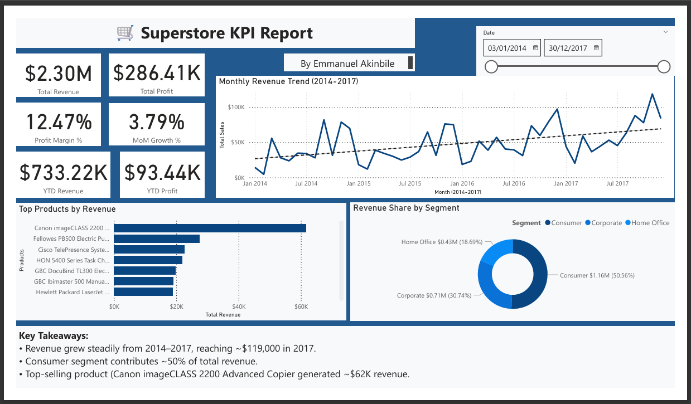

# Superstore KPI Dashboard  
**Data Analytics | SQL | Power BI | Data Visualization**

---

## Overview  

This project analyzes sales performance, profit margins, and key business trends using the **Superstore dataset**.  
The objective is to design a **KPI dashboard** that highlights performance across regions, product categories, and customer segments, enabling data-driven decision-making.  

This project demonstrates my ability to:  
- Clean, transform, and model raw data using **SQL Server**  
- Build and calculate KPIs (Revenue, Profit Margin, Growth Rate, etc.)  
- Visualize business insights interactively using **Power BI**  
- Communicate actionable findings clearly and effectively  

---

## Business Problem  

A retail company wants to better understand its sales performance across regions, products, and customers.  
They need an analytics solution that can answer:  

- Which regions or product categories drive the most profit?  
- How have monthly sales and profit margins changed over time?  
- Which customer segments contribute most to revenue growth?  
- How effective are discounts in improving overall profitability?  

---

## Dataset  

**Source:** [Kaggle – Superstore Dataset (Vivek468)](https://www.kaggle.com/datasets/vivek468/superstore-dataset-final)  
**Rows:** ~9,995  
**Columns:** 21  

**Key Fields:**  
- `Order Date`, `Region`, `Category`, `Sub-Category`, `Sales`, `Profit`, `Discount`, `Quantity`  
- `Customer ID`, `Segment`, `State`, `City`  

**Data Location:**  
data/raw/superstore_sales_raw.csv

---

## Process  

### 1. Data Cleaning & Preparation  
- Imported raw data into SQL Server  
- Cleaned and standardized date, category, and region fields  
- Removed nulls and invalid values  
- Created calculated fields such as:  
  - `Profit_Margin = Profit / Sales`  
  - `Sales_After_Discount = Sales * (1 - Discount)`  
- Validated totals and ensured data consistency  

### 2. KPI Development  
Defined key metrics for business monitoring:  
| KPI | Formula | Description |
|------|----------|-------------|
| **Total Sales** | `SUM(Sales)` | Total revenue generated |
| **Total Profit** | `SUM(Profit)` | Overall profitability |
| **Profit Margin %** | `Profit / Sales` | Profit efficiency |
| **Monthly Growth Rate** | `(Current – Previous) / Previous` | Trend strength |
| **Customer Retention Rate** | `Returning Customers / Total Customers` | Loyalty indicator |

### 3. Data Modeling & Visualization  
- Connected SQL Server to Power BI  
- Built data relationships and measures using DAX  
- Designed interactive visuals (cards, trend lines, category breakdowns, region maps)  
- Created a unified dashboard summarizing KPIs and trends  

---

## Dashboard Preview 


▶ **View and Download Full Interactive Dashboard (.pbix)**  
[superstore_dashboard.pbix](powerbi/pbix/Superstore_KPI_Report.pbix)

---

## Insights

### Executive Summary
- Revenue increased steadily from 2014 to 2017, indicating strong year-over-year performance.
- The Consumer segment contributed approximately half of all revenue, making it the dominant customer segment.
- Technology was the top-performing category in total revenue, while Office Supplies showed consistent but lower-volume performance.
- The leading product, Canon ImageCLASS 2200, generated approximately $62K in total revenue.
- Profit margins were generally healthy, although month-to-month variation was present.

### Category and Product Performance
- Technology produced the highest revenue, followed by Furniture and Office Supplies.
- High-performing subcategories included Phones, Chairs, and Storage.
- Several subcategories, such as Tables and Bookcases, generated negative profit, suggesting issues with pricing or discounting.
- Profit margin analysis identified clear high-performing subcategories along with low-margin outliers.
- The Top 10 Products visual highlighted a mix of strong revenue generators and products with weak profitability.

### Revenue Breakdown Explorer
- The most impactful revenue path was Consumer > Technology > Phones.
- The decomposition tree revealed clear clusters of high-value product combinations.
- Lower-value and low-margin combinations were easily identifiable for further review.
- The breakdown confirmed that a small number of product paths account for a significant share of overall revenue.

### Customer Insights
- The dataset included 793 unique customers.
- Average revenue per customer was approximately $230, while average profit per customer was approximately $29.
- Customers placed an average of 12.6 orders, indicating repeat purchasing behavior.
- The West region led in both total revenue and total profit, while the South region trailed.
- Revenue by state showed strong geographic concentration in California, New York, and Texas.
- The Consumer segment represented the majority of both sales volume and profitability.

### Price, Discount, and Unit Analysis
- The average discount across all orders was 15.63%.
- High-discount subcategories frequently produced negative profit, especially Tables and Bookcases.
- High-priced categories, such as Technology, delivered strong profit despite lower unit volume.
- The bubble chart highlighted negative-profit outliers driven largely by elevated discount rates.
- Approximately 38,000 total units were sold, with Office Supplies leading in unit volume.

### Order and Shipping Insights
- The median lead time was 4 days, with a maximum of 7 and a minimum of 0.
- Most shipments were delivered within 3 to 5 days, indicating operational consistency.
- Monthly average lead times showed minimal variation, ranging from approximately 3.7 to 4.2 days.
- Geographic patterns revealed that some central states experienced slightly longer average lead times.
- The average revenue per order was approximately $458, reflecting strong order value.
Key findings will be summarized here after dashboard completion — focusing on trends, outliers, and strategic recommendations.

---

## Tools & Technologies  

| Tool | Purpose |
|------|----------|
| **SQL Server** | Data cleaning, transformation, and KPI calculations |
| **Power BI** | Dashboard visualization and DAX metrics |
| **Excel** | Exploratory analysis and validation |
| **GitHub** | Version control and project documentation |

---

## Repository Structure  

``` plaintext

superstore-kpi-dashboard/
│
├── data/
│ ├── raw/ # Untouched Kaggle dataset
│ └── cleaned/ # Cleaned and transformed data
│
├── sql/ # SQL scripts
│ ├── clean_superstore.sql
│ └── summary_kpis.sql
│
├── powerbi/ # Power BI files and visuals
│ ├── superstore_dashboard.pbix
│ └── visuals/
│
├── docs/ # Additional documentation
│ ├── Project_Report.pdf
│ └── README_DATA.md
│
└── README.md # Main project overview
```
---

## Contact  

**Emmanuel Akinbile**  
Niagara Falls, ON  
[emmanuelakinbile@gmail.com](mailto:emmanuelakinbile@gmail.com)  
[LinkedIn](https://www.linkedin.com/in/emmanuel-akinbile) | [GitHub](https://github.com/EmmanuelAkinbile)

---

> *This repository is part of my data analytics portfolio showcasing skills in SQL, Power BI, and KPI dashboard design.*

